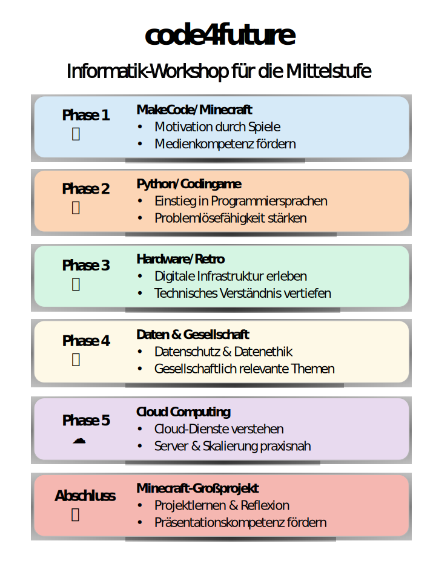

**code4future** ist ein Bildungsprojekt für Kinder und Jugendliche aus nicht technikaffinen oder bildungsnahen Haushalten – darunter auch geflüchtete Kinder, wie im Artikel [Programmierangebote für geflüchtete Kinder und Jugendliche in Stuttgart](./Programmierangebote%20fuer%20Kinder%20und%20Jugendliche.md) beschrieben. Das Projekt möchte allen jungen Menschen – unabhängig von ihrer sozialen Herkunft – den Zugang zur Informatik erleichtern. Statt sie mit abstrakter Theorie zu überfordern, nutzt code4future spielerische Zugänge, sprechende Metaphern und vertraute Lernumgebungen wie Minecraft, um das Programmieren verständlich und motivierend zu gestalten. Ziel ist es, Kinder zu befähigen, digitale Kompetenzen selbstbewusst zu entwickeln und aktiv an der digitalen Gesellschaft teilzunehmen – als kreative Gestalter*innen ihrer Zukunft.

Inspiriert von:
* https://codeforfuture.eu
* https://hacker-school.de
* https://adventuresinminecraft.github.io
* https://education.minecraft.net
* https://code.org

---

### Phasen des Lehrplans

Die folgende Übersicht zeigt, wie der Jahreslehrplan von code4future strukturiert ist und welche Verbindung er zwischen spielerischem Lernen, praktischer Anwendung und den curricularen Zielen herstellt. Sie verdeutlicht zugleich, wie sich das Konzept an den didaktischen Prinzipien orientiert, die Kinder Schritt für Schritt vom spielerischen Einstieg bis zu komplexeren Projekten führen.

| Phase         | Wochen | Inhalt und Schwerpunkte im code4future-Konzept|
| ------------- | ------ | ------------------------------------------------------------------------------------------------------------------------------------------------------------------------------------------------------------------------------------------------------------------------------------------------------- |
| **Phase 1**   | 1–10   | **EduBlocks.org, MakeCode & Minecraft:**  - Einstieg in Programmierlogik mit EduBlocks.org & MakeCode  - Minecraft-Thema für Motivation (Figuren, Ressourcen sammeln)  - Erste Tippübungen                                                                                                     |
| **Phase 2**   | 11–20  | **Code.org Minecraft-Kurse, Python & CodeCombat:**  - Vertiefung der Logik mit Code.org Minecraft-Puzzles  - Einstieg in Python (Variablen, Schleifen, Bedingungen)  - CodeCombat für algorithmisches Denken  - Tippübungen für Sonderzeichen                                                 |
| **Phase 3**   | 21–30  | **Hardware (micro:bit, Arduino/Raspberry Pi), Retro-Computing & Assembler:**  - micro:bit als Einstieg in physisches Computing  - Arduino/Raspberry Pi für erweiterte Sensorik/Ausgaben  - Retro-Computing (C64, BASIC) & optional Assembler  - Minecraft-Analogie mit Redstone-Schaltungen |
| **Phase 4**   | 31–35  | **Daten & Gesellschaft:**  - Grundlagen zu Datenanalyse und Datenschutz  - Minecraft-Datenprojekte (z. B. Analyse von Ressourcen und Redstone-Netzwerken)  - Diskussion gesellschaftlicher Aspekte wie Datensicherheit  - Einführung in Datenvisualisierung                                 |
| **Phase 5**   | 36–40  | **Cloud Computing mit Minecraft-Fokus:**  - Minecraft CloudCraft & Microsoft Learning Challenge Cloud Games  - AWS Cloud Quest & Escape Room für Cloud-Dienste (Server, Skalierung)  - Eigenen Minecraft-Server in der Cloud hosten                                                            |
| **Abschluss** | 41–45  | **Großes Minecraft-Projekt & Reflektion:**  - Eigenes, frei gewähltes Projekt mit Minecraft-Bezug (z. B. Modding, Hardware-Interface, Retro-Game, Cloud-Anwendung)  - Präsentation und Feedbackrunde                                                                                              |
---

### **Fazit:**  

**code4future** bietet einen klar strukturierten, phasenbasierten Plan, der – ähnlich wie [CSD von Code.org](https://studio.code.org/courses/csd-2025) – darauf abzielt, zentrale digitale Kompetenzen zu fördern, dabei jedoch konsequent *Minecraft* einsetzt, um Motivation und Lernerlebnis zu steigern. Im Mittelpunkt steht die Förderung von **Programmier-, Medien- und Zukunftskompetenzen** durch spielerisches Lernen mit EduBlocks.org, MakeCode, Python und Hardware-Experimenten. Dabei werden Themen wie **Chancengleichheit, digitale Teilhabe und interkulturelles Lernen** praktisch erlebbar gemacht. Ziel ist es, einen Lehrplan zur Verfügung zu stellen, der sowohl motiviert als auch umfassend auf die digitale Zukunft vorbereitet – mit *Minecraft* als Brücke zwischen spielerischer Motivation und nachhaltigem Lernen.